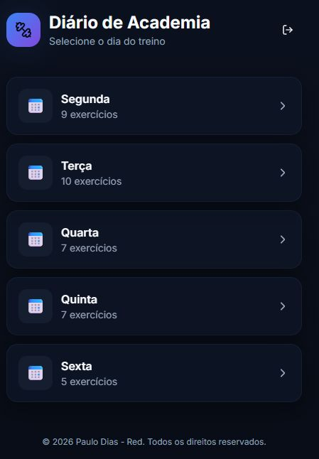
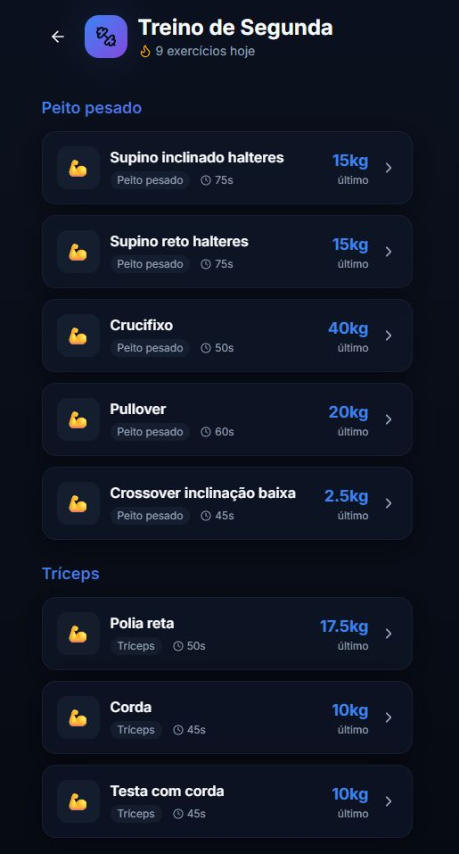
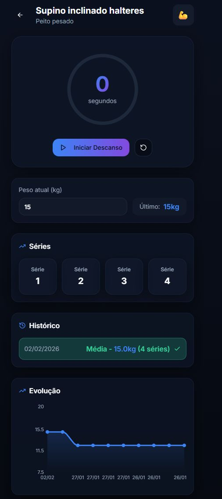

# Diario de Academia

Aplicacao web para acompanhar treinos de musculacao e cardio, registrando series, carga e evolucao ao longo dos dias.

O projeto foi iniciado no Lovable e evoluido para desenvolvimento local com React + TypeScript.

## Sobre o projeto

Em 2026 eu cismei que queria emagrecer. Entrei na academia em 21 de janeiro e logo percebi que sempre me perdia no numero de series e, pior, esquecia o peso que tinha usado em cada aparelho.

E claro... eu nao queria pagar por app nenhum pra isso kkkkk. Entao separei uma noite e fiz esse projetinho.

Ele e simples e direto: meu treino ja estava montado, entao so organizei tudo no app. Hoje eu consigo marcar exatamente em qual serie estou, recuperar automaticamente o ultimo peso usado, consultar um historico rapido e usar um timer de descanso animado.

Esta tudo responsivo (testado no meu Redmi Note 12 Pro) e cumpre exatamente o objetivo principal: me ajudar durante o treino sem complicacao.

Nas proximas versoes, quero adicionar edicao de treino e criacao de treino do zero.

## Screenshots






## Funcionalidades

- Autenticacao com Firebase (email/senha e Google)
- Selecao de treino por dia da semana (Segunda a Sexta)
- Registro de series por exercicio com controle de conclusao
- Temporizador de descanso entre series
- Marcacao de cardio concluido
- Historico recente por exercicio com media de carga
- Grafico de evolucao de progresso
- Persistencia dos registros no Firestore por usuario

## Stack do projeto

- React 18
- TypeScript
- Vite
- Tailwind CSS
- shadcn/ui + Radix UI
- Framer Motion
- Firebase (Auth + Firestore)
- Vitest + Testing Library

## Como rodar localmente

### 1) Requisitos

- Node.js 18+ (recomendado 20+)
- npm 9+

### 2) Instalacao

```bash
git clone <URL_DO_REPOSITORIO>
cd diario-de-academia
npm install
```

### 3) Ambiente Firebase

Atualmente as credenciais estao definidas em `src/lib/firebase.ts`.

Se quiser usar seu proprio projeto Firebase:

1. Crie um projeto no Firebase
2. Ative Authentication (Email/Senha e Google, opcional)
3. Crie um banco Firestore
4. Substitua as chaves em `src/lib/firebase.ts`

### 4) Executar

```bash
npm run dev
```

Abra o endereco mostrado no terminal (normalmente `http://localhost:5173`).

## Scripts disponiveis

- `npm run dev`: inicia ambiente de desenvolvimento
- `npm run build`: gera build de producao
- `npm run build:dev`: gera build em modo development
- `npm run preview`: sobe servidor para visualizar o build
- `npm run lint`: executa ESLint
- `npm run test`: executa testes uma vez
- `npm run test:watch`: executa testes em modo observacao

## Estrutura principal

```txt
src/
  components/      # componentes de UI e fluxo de treino
  contexts/        # contexto de autenticacao
  data/            # definicao dos treinos e tipos
  hooks/           # hooks de auth e persistencia
  lib/             # integracoes (Firebase, utils)
  pages/           # paginas principais
```

## Deploy

O projeto possui `public/_redirects`, facilitando deploy em plataformas estaticas com SPA (ex.: Netlify).

Fluxo recomendado:

1. `npm run build`
2. Publicar o conteudo da pasta `dist`

## Proximos passos sugeridos

- Mover configuracao Firebase para variaveis de ambiente (`.env`)
- Adicionar mais testes de componentes e fluxo de treino
- Criar dashboard com estatisticas semanais/mensais
